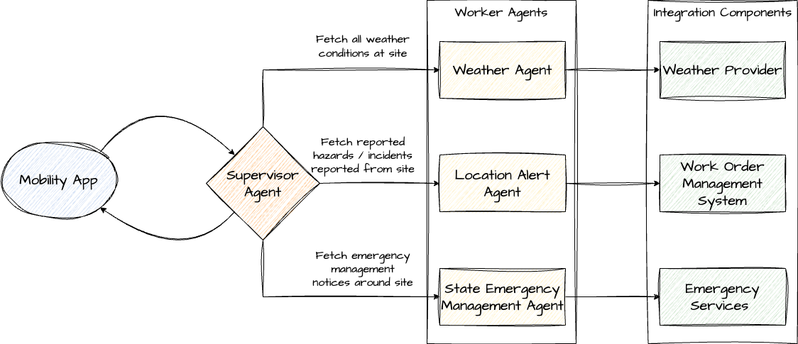
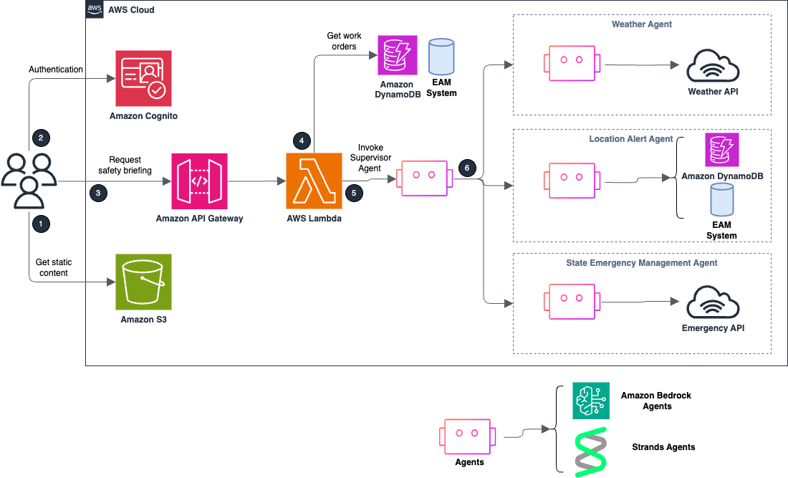

# Gen AI Based Field Workforce Safety Assistant

This AWS sample demonstrates how to build a multi-agent AI system for field workforce safety using Amazon Bedrock and other AWS services. 

## Overview

Field workforce safety is a critical concern across industries such as utilities, construction, and oil & gas, where workers face significant risks during infrastructure maintenance and emergency response operations. This solution leverages generative AI and multi-agent systems to help organizations:

- Automate safety assessments and risk analysis
- Provide real-time safety guidance and emergency response
- Ensure regulatory compliance through intelligent monitoring
- Reduce workplace incidents through proactive safety measures

## Architecture

The solution implements a multi-agent architecture where specialized AI agents collaborate to address different aspects of workforce safety:

- **Supervisor Agent**: Orchestrates workflows and coordinates between specialized agents
- **Weather Agent**: Analyzes weather conditions and environmental hazards
- **Location Agent**: Provides site-specific safety information and geographic context
- **Safety Officer Agent**: Enforces safety protocols and compliance requirements
- **Emergency Management Agent**: Handles incident response and emergency procedures

### Architecture Diagrams


*Figure 1: Field Workforce Safety AI Assistant workflow*


*Figure 2: Field Workforce Safety AI Assistant AWS architecture*


## AWS Services Used

This solution leverages the following AWS services:

- **Amazon Bedrock**: Foundation models and AI agent orchestration
- **AWS Lambda**: Serverless compute for agent logic and API handlers
- **Amazon DynamoDB**: NoSQL database for storing work orders and safety data
- **Amazon API Gateway**: RESTful APIs for frontend-backend communication
- **Amazon Cognito**: User authentication and authorization
- **Amazon S3**: Object storage for documents and media files
- **AWS CloudFormation**: Infrastructure as Code deployment

## Prerequisites

Before deploying this solution, ensure you have:

- An AWS account with appropriate permissions
- Access to Amazon Bedrock foundation models (tested with Anthropic Claude 3.5+ and Amazon Nova Pro/Premier)
- Enabled required models in the [Amazon Bedrock console](https://us-east-1.console.aws.amazon.com/bedrock/home?region=us-east-1#/modelaccess)
- AWS CLI installed and configured
- Docker installed (for CDK deployment option)

> **Note**: We recommend using Cross Region Inference profiles for improved agent performance. See the [Amazon Bedrock documentation](https://docs.aws.amazon.com/bedrock/latest/userguide/cross-region-inference.html) for setup instructions.

## Deployment

Choose one of the following deployment methods:

### Option 1: AWS CloudFormation (Recommended)

1. Navigate to the AWS CloudFormation console in your preferred region
2. Create a new stack using the template from the `cfn-templates/` directory
3. Configure the following parameters:
   - **CollaboratorFoundationModel**: Foundation model ID for the collaborator agent (default: `anthropic.claude-3-5-haiku-20241022-v1:0`)
   - **SupervisorFoundationModel**: Foundation model ID for the supervisor agent (default: `anthropic.claude-3-7-sonnet-20250219-v1:0`)
4. Review and create the stack (deployment takes approximately 15-20 minutes)
5. Once deployment completes, find the **FrontendUrl** in the stack outputs to access the application

### Option 2: AWS CDK

#### Prerequisites
- Python 3.8 or later
- Node.js 14.x or later
- AWS CDK CLI installed (`npm install -g aws-cdk`)

#### Deployment Steps

1. **Set up the environment**:
   ```bash
   cd cdk
   python3 -m venv .venv
   source .venv/bin/activate  # On Windows: .venv\Scripts\activate.bat
   pip install -r requirements.txt
   ```

2. **Authenticate with AWS ECR Public**:
   ```bash
   aws ecr-public get-login-password --region us-east-1 | docker login --username AWS --password-stdin public.ecr.aws
   ```

3. **Bootstrap CDK (first-time setup)**:
   ```bash
   cdk bootstrap
   ```

4. **Deploy the solution**:
   ```bash
   cdk deploy FieldWorkForceSafetyMainStack \
     --require-approval never \
     --context collaborator_foundation_model="claude-3-5-haiku-20241022-v1:0" \
     --context supervisor_foundation_model="anthropic.claude-3-7-sonnet-20250219-v1:0"
   ```

5. **Access the application**: The frontend URL will be displayed in the deployment output

## Usage

After successful deployment:

1. Navigate to the provided frontend URL
2. Create a user account or sign in
3. Configure your profile settings and preferences
4. Create work orders and receive AI-powered safety briefings
5. Access emergency warnings and location-specific safety information

## Cleanup

To avoid ongoing charges, remove the deployed resources:

**CloudFormation**: Delete the stack from the AWS CloudFormation console

**CDK**: Run the following command:
```bash
cdk destroy FieldWorkForceSafetyMainStack --require-approval never
```

## Security
Please see the [security guidelines](documentation/security.md).

## Contributing

We welcome contributions! Please see our [contributing guidelines](CONTRIBUTING.md) for details on how to submit pull requests, report issues, and suggest improvements.

## License

This sample code is licensed under the MIT-0 License. See the [LICENSE](LICENSE) file for details.


## Content Security Legal Disclaimer
Sample code, software libraries, command line tools, proofs of concept, templates, or other related technology are provided as AWS Content or Third-Party Content under the AWS Customer Agreement, or the relevant written agreement between you and AWS (whichever applies). You should not use this AWS Content or Third-Party Content in your production accounts, or on production or other critical data. You are responsible for testing, securing, and optimizing the AWS Content or Third-Party Content, such as sample code, as appropriate for production grade use based on your specific quality control practices and standards. Deploying AWS Content or Third-Party Content may incur AWS charges for creating or using AWS chargeable resources, such as running Amazon EC2 instances or using Amazon S3 storage.
